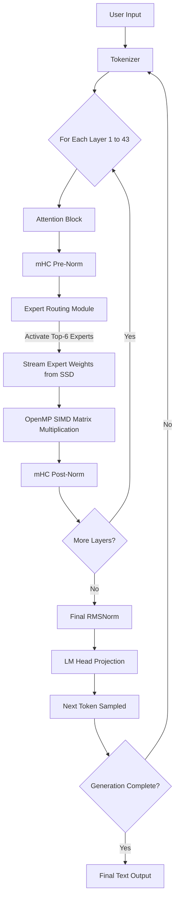

# DeepSeek-C Architecture Overview

This document provides a high-level breakdown of both the **DeepSeek-V4-Flash** neural network model architecture and the custom **DeepSeek-C** runtime engine we built to execute it on consumer hardware.

---

## 1. The Model Architecture: DeepSeek-V4-Flash
DeepSeek-V4 is a state-of-the-art "Frontier" class Large Language Model. Unlike traditional dense models where every parameter is used for every word, DeepSeek uses a **Mixture-of-Experts (MoE)** architecture.

### Key Specifications:
*   **Total Parameters:** 284 Billion
*   **Active Parameters:** 13 Billion per token
*   **Context Length:** 1 Million tokens
*   **Native Precision:** FP8 (8-bit floating point) Mixed

### Architectural Innovations:
*   **MoE Routing:** Instead of a standard feed-forward layer, V4 uses a gating network that routes tokens to specific "expert" neural networks. V4 utilizes sigmoid-based top-k routing to selectively activate only the 13B parameters needed for a given token, saving massive amounts of compute.
*   **Attention Mechanism:** Utilizes variations of heavily compressed latent attention (such as MLA/CSA) to drastically reduce the size of the KV-Cache, allowing for massive context lengths without exploding memory requirements.
*   **mHC (Manifold-Constrained Hyper-Connections):** A novel residual connection technique utilizing Sinkhorn-Knopp normalization to stabilize the outputs of the sparse experts before they rejoin the main data stream.

---

## 2. The Engine Architecture: DeepSeek-C
Running a 284B parameter model traditionally requires server racks with hundreds of gigabytes of VRAM. To run this on a laptop, we built a highly specialized C-engine based on the minimalist `colibri` framework.

### Memory Mapping (`mmap`)
This is the core of the engine. Instead of loading the model into RAM:
1. The `.exe` asks the Operating System to treat the `safetensors` files on the SSD as if they were already in RAM.
2. As the engine steps through the layers, it directly references the SSD storage addresses.
3. The CPU streams the weights across the USB-C/NVMe bus on the fly. 
4. This keeps the actual RAM usage incredibly low (only needing ~16GB for the KV Cache and buffers).

### INT4 Quantization
To speed up the SSD streaming, the FP8 model is compressed down to 4-bit integers (INT4).
*   **The Math:** 284B parameters shrink from ~295 GB down to ~150 GB.
*   **The Benefit:** The CPU has to pull exactly half as much data through the cable per token, effectively doubling the generation speed.

### Multithreading
The C engine utilizes **OpenMP** to split the matrix multiplication math across all available CPU cores. It leverages `AVX2` instruction sets to multiply the 4-bit integers rapidly without needing a dedicated Graphics Card (GPU).

---

## 3. Flowchart: The Generation Loop
When you type a prompt, the engine executes this loop for every single word:

1. **Tokenize** the input.
2. **Stream** the active expert weights (6.5 GB of data) from the external SSD into the CPU.
3. **Multiply** the weights using OpenMP multithreading.
4. **Normalize** the outputs via mHC.
5. **Output** the highest-probability next token.
