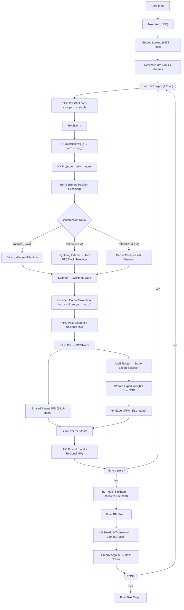

# DeepSeek-C Architecture Overview

This document provides a high-level breakdown of both the **DeepSeek-V4-Flash** neural network model architecture and the custom **DeepSeek-C** runtime engine we built to execute it on consumer hardware.

---

## 1. The Model Architecture: DeepSeek-V4-Flash
DeepSeek-V4 is a state-of-the-art "Frontier" class Large Language Model. Unlike traditional dense models where every parameter is used for every word, DeepSeek uses a **Mixture-of-Experts (MoE)** architecture.

### Key Specifications:
*   **Total Parameters:** 284 Billion
*   **Active Parameters:** 13 Billion per token
*   **Context Length:** 1 Million tokens
*   **Native Precision:** FP8 (8-bit floating point) Mixed
*   **Layers:** 43 transformer blocks
*   **Experts:** 256 routed + 1 shared, top-6 activated per token

### Architectural Innovations:
*   **MoE Routing:** Sigmoid-based `sqrtsoftplus` scoring selects the top-6 experts per token. The first 3 layers use deterministic hash routing for stability.
*   **Multi-head Latent Attention (MLA):** Q and KV projections go through a low-rank bottleneck (`q_lora_rank=1024`, `kv_lora_rank=512`) to dramatically reduce KV cache size.
*   **Compressed Sparse Attention (CSA):** Layers with `compress_ratio=4` compress every 4 tokens into 1 compressed KV block. A **Lightning Indexer** neural network scores all compressed blocks and selects the top-512 most relevant ones for attention.
*   **Heavily Compressed Attention (HCA):** Layers with `compress_ratio=128` compress 128 tokens into 1 block. Dense attention over all available blocks (no top-k selection needed since there are very few blocks).
*   **mHC (Manifold-Constrained Hyper-Connections):** A novel residual connection technique utilizing Sinkhorn-Knopp normalization across 4 parallel streams (`hc_mult=4`) to stabilize the outputs of the sparse experts before they rejoin the main data stream.
*   **Grouped Output Projection:** The attention output is split into 8 groups (`o_groups=8`), each independently projected through `wo_a[1024, 4096]`, then concatenated and projected back through `wo_b[4096, 8192]`.

---

## 2. The Engine Architecture: DeepSeek-C
Running a 284B parameter model traditionally requires server racks with hundreds of gigabytes of VRAM. To run this on a laptop, we built a highly specialized C-engine based on the minimalist `colibri` framework.

### Memory Mapping (`mmap`)
This is the core of the engine. Instead of loading the model into RAM:
1. The `.exe` asks the Operating System to treat the `safetensors` files on the SSD as if they were already in RAM.
2. As the engine steps through the layers, it directly references the SSD storage addresses.
3. The CPU streams the weights across the USB-C/NVMe bus on the fly. 
4. This keeps the actual RAM usage incredibly low (only needing ~16GB for the KV Cache and buffers).

### INT4 Quantization
To speed up the SSD streaming, the FP8 model is compressed down to 4-bit integers (INT4).
*   **The Math:** 284B parameters shrink from ~295 GB down to ~150 GB.
*   **The Benefit:** The CPU has to pull exactly half as much data through the cable per token, effectively doubling the generation speed.

### Multithreading
The C engine utilizes **OpenMP** to split the matrix multiplication math across all available CPU cores. It leverages `AVX2` instruction sets to multiply the 4-bit integers rapidly without needing a dedicated Graphics Card (GPU).

### Lightning Indexer
For CSA layers (compress_ratio=4), the engine uses the downloaded indexer weights (`idx_wq_b`, `idx_wproj`) to perform a lightweight neural-network query that scores all compressed KV blocks and selects the top-512 most relevant ones. This replaces the earlier mock fallback that just picked the most recent blocks sequentially.

---

## 3. Flowchart: The Generation Loop
When you type a prompt, the engine executes this loop for every single word:

---

## 4. File Structure

| File | Purpose |
|------|---------|
| `dsv4.c` | Core inference engine (~855 lines) |
| `dsv4_tensor_wire.h` | Maps safetensors names to C structs |
| `math_dsv4.h` | INT4/INT8 SIMD matmul kernels |
| `st.h` | Safetensors file parser and mmap loader |
| `tok.h` | BPE tokenizer |
| `json.h` | Minimal JSON parser |
| `compat.h` | Windows/Linux compatibility |
| `tools/convert_fp8_to_int4.py` | FP8→INT4 weight converter with surgical indexer download |
